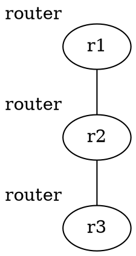

# dot2net

**dot2net** implements **Topology-driven Configuration**, a revolutionary approach that separates network topology from generalized configuration settings. Instead of manually editing multiple device configurations when adding a single router, dot2net generates all required configuration files from a simple topology graph (DOT) and reusable configuration templates (YAML).

## How dot2net Works


dot2net transforms network topology into emulation-ready configurations through a 4-step process:

1. **Convert**: Parse DOT topology into network model with object instances
2. **Assign parameters**: Automatically calculate IP addresses, interface names, and other parameters
3. **Embed variables**: Process templates with assigned parameters to generate config blocks
4. **Merge and format**: Combine config blocks into final configuration files and deployment specifications

This separation enables **topology-driven configuration** where changing the network layout only requires modifying the DOT file, while all device configurations are automatically regenerated.

## 🚀 Quick Start

### Prerequisites

**For building dot2net:**
- Go 1.23+ OR Docker

**For deploying generated networks:**
- **Using Containerlab/TiNET**: Linux environment with Docker and sudo privilege
- **Manual deployment**: Any environment (dot2net generates config files only)

**Deployment platforms (choose one):**
- [Containerlab](https://containerlab.dev/) - container-based network labs
- [TiNET](https://github.com/tinynetwork/tinet) - Linux namespace-based emulation

### Installation & Basic Usage

```bash
# 1. Build dot2net
go build .
# or with Docker: docker run --rm -i -v $PWD:/v -w /v golang:1.23.4 go build -buildvcs=false

# 2. Navigate to a tutorial scenario
cd tutorial/

# 3. Generate configuration files
dot2net build -c ./input.yaml ./input.dot
# This creates: r1/, r2/, r3/ directories + topo.yaml + spec.yaml

# 4a. Deploy with Containerlab
sudo containerlab deploy --topo topo.yaml
# Test connectivity: docker exec -it clab-tutorial-r1 ping <r3_ip>
# Cleanup: sudo containerlab destroy --topo topo.yaml

# 4b. Or deploy with TiNET
tinet up -c spec.yaml | sudo sh -x
tinet conf -c spec.yaml | sudo sh -x
# Cleanup: tinet down -c spec.yaml | sudo sh -x
```

### Understanding dot2net Files

- **`input.dot`**: Network topology in DOT language (Graphviz format)
- **`input.yaml`**: Configuration templates, IP policies, and class definitions
- **Generated files**: Node-specific config directories + platform deployment files

**Example topology (`input.dot`):**


## 📖 Complete Documentation

For comprehensive documentation including detailed syntax, configuration examples, and best practices, visit the **[dot2net Wiki](https://github.com/cpflat/dot2net/wiki)**.

## 🌟 Key Features

- **Automatic Parameter Assignment**: IP addresses, interface names, and other parameters
- **Flexible Class System**: Reusable node, interface, connection, and group configurations
- **Template-Based Configuration**: Generate any configuration format using Go templates
- **Multi-Platform Support**: TiNET and Containerlab emulation platforms
- **Conflict Detection**: Intelligent detection and reporting of configuration conflicts
- **Scalable Design**: Handle large networks with hundreds of nodes and connections

## 📋 Supported Platforms

- **[TiNET](https://github.com/tinynetwork/tinet)**: Linux namespace-based network emulation
- **[Containerlab](https://containerlab.dev/)**: Container-based network labs

## 🤝 Community

- **GitHub**: [https://github.com/cpflat/dot2net](https://github.com/cpflat/dot2net)
- **Wiki**: [https://github.com/cpflat/dot2net/wiki](https://github.com/cpflat/dot2net/wiki)
- **Issues**: Report bugs and request features
- **Pull Requests**: Contribute code improvements and fixes

## 📚 Academic Publications

dot2net has been published and demonstrated in peer-reviewed academic venues:

### IEEE Transactions on Network and Service Management (2025)
**"Topology-Driven Configuration of Emulation Networks With Deterministic Templating"**
*Satoru Kobayashi, Ryusei Shiiba, Shinsuke Miwa, Toshiyuki Miyachi, Kensuke Fukuda*
[DOI: 10.1109/TNSM.2025.3582212](https://doi.org/10.1109/TNSM.2025.3582212) (Early Access)

### CNSM 2023
**"dot2net: A Labeled Graph Approach for Template-Based Configuration of Emulation Networks"**
*Satoru Kobayashi, Ryusei Shiiba, Ryosuke Miura, Shinsuke Miwa, Toshiyuki Miyachi, Kensuke Fukuda*
[DOI: 10.23919/CNSM59352.2023.10327865](https://doi.org/10.23919/CNSM59352.2023.10327865)

### Citation Information

If you use dot2net in your research, please consider citing our work:

```bibtex
@article{Kobayashi_dot2net2025,
    author={Kobayashi, Satoru and Shiiba, Ryusei and Miwa, Shinsuke and Miyachi, Toshiyuki and Fukuda, Kensuke},
    journal={IEEE Transactions on Network and Service Management},
    title={Topology-Driven Configuration of Emulation Networks With Deterministic Templating},
    volume={},
    number={},
    pages={1-14},
    year={2025},
    doi={10.1109/TNSM.2025.3582212}
}

@inproceedings{Kobayashi_dot2net2023,
    author={Kobayashi, Satoru and Shiiba, Ryusei and Miura, Ryosuke and Miwa, Shinsuke and Miyachi, Toshiyuki and Fukuda, Kensuke},
    booktitle={19th International Conference on Network and Service Management (CNSM)},
    title={dot2net: A Labeled Graph Approach for Template-Based Configuration of Emulation Networks},
    pages={1-9},
    year={2023},
    doi={10.23919/CNSM59352.2023.10327865}
}
```

## License

This project is licensed under the [Apache License 2.0](LICENSE).