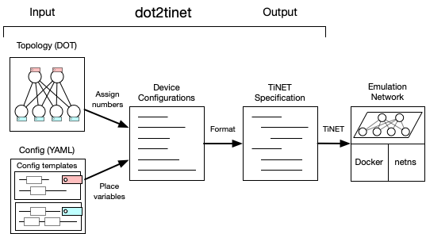
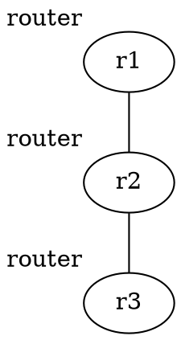

# dot2net

**dot2net** implements **Topology-driven Configuration**, an approach that separates the structure of a network from the configuration of the things in it. Instead of manually editing multiple device configurations when adding a single router, dot2net generates all required configuration files from a graph (DOT) and reusable configuration templates (YAML).

> **A word used in a particular way.** A **topology** here is not just the graph:
> it is what you write — the DOT file *and* the YAML that configures it — taken
> together, one network you can generate and deploy. When only the graph is
> meant, this documentation says **the DOT file** or **the graph**. See
> [Basic Concepts](https://github.com/cpflat/dot2net/wiki/Basic-Concepts).

## How dot2net Works



dot2net transforms network topology into emulation-ready configurations through a 4-step process:

1. **Convert**: Parse DOT topology into network model with object instances
2. **Assign parameters**: Automatically calculate IP addresses, interface names, and other parameters
3. **Embed variables**: Process templates with assigned parameters to generate config blocks
4. **Merge and format**: Combine config blocks into final configuration files and deployment specifications

This separation enables **topology-driven configuration** where changing the network layout only requires modifying the DOT file, while all device configurations are automatically regenerated.

## 🚀 Quick Start

### Prerequisites

**For building dot2net:**
- Go 1.23+ OR Docker

**For deploying generated networks:**
- **Using Containerlab/TiNET**: Linux environment with Docker and sudo privilege
- **Manual deployment**: Any environment (dot2net generates config files only)

**Deployment platforms (choose one, or generate for several at once):**
- [Containerlab](https://containerlab.dev/) - container-based network labs
- [TiNET](https://github.com/tinynetwork/tinet) - Linux namespace-based emulation
- [Kathara](https://www.kathara.org/) - container-based network emulator built for teaching

### Installation & Basic Usage

```bash
# 1. Build dot2net
go build .
# or with Docker: docker run --rm -i -v $PWD:/v -w /v golang:1.23.4 go build -buildvcs=false

# 2. Navigate to the tutorial topology
cd tutorial/

# 3. Generate configuration files
#    (the build above puts dot2net in the repository root)
../dot2net build -c ./input.yaml ./input.dot
# This creates: r1/, r2/, r3/ + topo.yaml (containerlab) + spec.yaml (TiNET)
#               + kathara/ (Kathara), all from the one pair of input files

# 4a. Deploy with Containerlab
sudo containerlab deploy --topo topo.yaml
# Test connectivity: docker exec -it clab-tutorial-r1 ping <r3_ip>
# Cleanup: sudo containerlab destroy --topo topo.yaml

# 4b. Or deploy with TiNET
tinet up -c spec.yaml | sudo sh -x
tinet conf -c spec.yaml | sudo sh -x
# Cleanup: tinet down -c spec.yaml | sudo sh -x
```

### Understanding dot2net Files

- **`input.dot`**: Network topology in DOT language (Graphviz format)
- **`input.yaml`**: Configuration templates, IP policies, and class definitions
- **Generated files**: Node-specific config directories + platform deployment files

**Example topology (`input.dot`):**

```dot
digraph {
    r1 [xlabel="router"];
    r2 [xlabel="router"];
    r3 [xlabel="router"];

    r1 -> r2 [dir="none"];
    r2 -> r3 [dir="none"];
}
```

## 📂 Where the topologies are

Three directories hold topologies, and they are for different things.

| Directory | What is in it | Read it to |
|---|---|---|
| **`tutorial/`** | One topology, walked through step by step in its own readme | Get a network up for the first time |
| **`topologies/`** | 13 networks worth deploying: the FRR topotests, the TiNET examples, and dot2net's own | Find something close to what you want and copy it |
| **`example/`** | 6 small topologies, each showing what one piece of the notation does | Understand a feature you met in the Wiki |

Everything in `topologies/` and `example/` carries an `expected/` holding the
output dot2net should produce for it, which the test suite checks on every
build. A topology is built by running dot2net inside its own directory:

```bash
cd topologies/ospf_simple
../../dot2net build -c input.yaml input.dot
```

Two worth knowing about:

- **`topologies/ospf_simple`** — the smallest thing that routes, and the one
  that generates for all three platforms. Start here.
- **`topologies/ospf_multihost`** — the same network placed on two machines.
  Its `expected/` is what a multi-machine lab looks like: one directory per
  machine holding that machine's nodes, its deployment file and its scripts,
  plus an `inter-host-links.txt` naming the links that no single machine's
  file can create.

## 📖 Complete Documentation

For comprehensive documentation including detailed syntax, configuration examples, and best practices, visit the **[dot2net Wiki](https://github.com/cpflat/dot2net/wiki)**.

## 🌟 Key Features

- **Automatic Parameter Assignment**: IP addresses, interface names, and other parameters
- **Flexible Class System**: Reusable node, interface, connection, and group configurations
- **Template-Based Configuration**: Generate any configuration format using Go templates
- **Multi-Platform Support**: Containerlab, TiNET and Kathara, from one topology
- **Labs Larger Than One Machine**: mark the machines in the graph and each gets a deployment file holding its own nodes and the links it can wire itself
- **Taking a Lab Down**: commands to run in a node before it goes, and files to copy back out of it
- **Conflict Detection**: Intelligent detection and reporting of configuration conflicts
- **Scalable Design**: Handle large networks with hundreds of nodes and connections

## 📋 Supported Platforms

- **[Containerlab](https://containerlab.dev/)**: Container-based network labs
- **[TiNET](https://github.com/tinynetwork/tinet)**: Linux namespace-based network emulation
- **[Kathara](https://www.kathara.org/)**: Container-based network emulator built for teaching

## 🤝 Community

- **GitHub**: [https://github.com/cpflat/dot2net](https://github.com/cpflat/dot2net)
- **Wiki**: [https://github.com/cpflat/dot2net/wiki](https://github.com/cpflat/dot2net/wiki)
- **Issues**: Report bugs and request features
- **Pull Requests**: Contribute code improvements and fixes

## 📚 Academic Publications

dot2net has been published and demonstrated in peer-reviewed academic venues:

### IEEE Transactions on Network and Service Management (2025)
**"Topology-Driven Configuration of Emulation Networks With Deterministic Templating"**
*Satoru Kobayashi, Ryusei Shiiba, Shinsuke Miwa, Toshiyuki Miyachi, Kensuke Fukuda*
[DOI: 10.1109/TNSM.2025.3582212](https://doi.org/10.1109/TNSM.2025.3582212)

### CNSM 2023
**"dot2net: A Labeled Graph Approach for Template-Based Configuration of Emulation Networks"**
*Satoru Kobayashi, Ryusei Shiiba, Ryosuke Miura, Shinsuke Miwa, Toshiyuki Miyachi, Kensuke Fukuda*
[DOI: 10.23919/CNSM59352.2023.10327865](https://doi.org/10.23919/CNSM59352.2023.10327865)

### Citation Information

If you use dot2net in your research, please consider citing our work:

```bibtex
@article{Kobayashi_dot2net2025,
    author={Kobayashi, Satoru and Shiiba, Ryusei and Miwa, Shinsuke and Miyachi, Toshiyuki and Fukuda, Kensuke},
    journal={IEEE Transactions on Network and Service Management},
    title={Topology-Driven Configuration of Emulation Networks With Deterministic Templating},
    volume={22},
    number={5},
    pages={3933-3946},
    year={2025},
    doi={10.1109/TNSM.2025.3582212}
}

@inproceedings{Kobayashi_dot2net2023,
    author={Kobayashi, Satoru and Shiiba, Ryusei and Miura, Ryosuke and Miwa, Shinsuke and Miyachi, Toshiyuki and Fukuda, Kensuke},
    booktitle={19th International Conference on Network and Service Management (CNSM)},
    title={dot2net: A Labeled Graph Approach for Template-Based Configuration of Emulation Networks},
    pages={1-9},
    year={2023},
    doi={10.23919/CNSM59352.2023.10327865}
}
```

## License

This project is licensed under the [Apache License 2.0](LICENSE).
