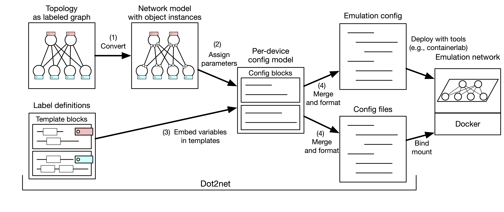

# dot2tinet

Dot2tinet generates configuration files for large-scale emulation networks
from a network topology (in DOT language) and configuration template (in YAML).
It automatically calculate and assign required parameters such as IP addresses to be embedded in the config,
so you only need to modify the topology graph when you want to chenge the network layout.
Dot2tinet currently supports [TiNET](https://github.com/tinynetwork/tinet)
and [Containerlab](https://containerlab.dev/) as an emulation network platform. 

# Overview

# Usage

## Build

    docker run --rm -i -t -v $PWD:/v -w /v golang:1.18 go build

## Deploy a network with TiNET

    // Generate tinet specification file
    dot2tinet tinet -c ./example/basic_bgp/bgp.yaml ./example/basic_bgp/bgp.dot > spec.yaml
    
    // Deploy
    tinet up -c spec.yaml
    tinet conf -c spec.yaml

    // Destroy
    tinet down -c spec.yaml

## Deploy a network with Containerlab

    // Generate containerlab topology file
    dot2tinet clab -c ./example/basic_bgp/bgp.yaml ./example/basic_bgp/bgp.dot > topo.yaml
    
    // Deploy
    containerlab deploy --topo topo.yaml

    // Destroy
    containerlab destroy --topo topo.yaml
 

# DOT files

    digraph  {
        n1;
        n2;
        n1->n2;
    }

The DOT files are considered as a "directed multigraph", which means that it allows multiple lines between a pair of nodes.
A node corresponds to a device node (a container or a bridge),
and a line corresponds to a connection between two nodes.

If all links have same meanings (and configurations), the DOT file only needs node name labels.

    digraph  {
        n1;
        n2;
        n1:eth0->n2:eth0;
    }

Interface names can be specified in port fields if needed
(It may cause warnings in other usages such as dot commands).

    digraph  {
        subgraph cluster1 {
            n1;
            n2;
            n1:eth0->n2:eth0;
        }
    }

Subgraph clusters can be defined as node groups.
It can be used for automated AS number assignment.

## Class labels

    digraph {
        n1;
        n2[xlabel="a"];
        n3[class="a"];
        n1->n2[label="b"];
        n2->n3[headlabel="b;c"];
        
        subgraph cluster1 {
            label="s"
            n4;
            n5;
        }
    }

Nodes or links of different configuration can be specified with classes.
The classes can be specified like tags; There can be multiple tags for one node or link (separated with ";" or ",").

There are 3 kinds of classes.
- Node Class: Specified in "xlabel", "class", "conf", or "info" of nodes (Note that "label" is not included).
- Interface Class: "headlabel", "headclass", "headconf", or "headinfo" specifies arrow-head-side interface class of the link. "taillabel", "tailclass", "tailconf", or "tailinfo" specified arrow-tail-side interface class of the link.
- Connection Class: Specified in "label", "class", "conf", or "info" of links. It just means two ends of interfaces have same configuration.
- Group Class: Specified in "label", "class", "conf", or "info" of subgraphs.

For example in the above DOT, the interface of n2 connected with n3 belongs to two Interface Classes, b and c.
The definition of these classes are defined in the config file.

If no labels are given, they refer "default" classes if exists.
Also, if "all" classes are defined, they affects all possible objects (nodes or interfaces).

In addition, one object only have one primary class label.
Primary class can define node setup information (e.g., node docker image).
There can be multiple non-primary class labels,
but the non-Primary classes cannot include these setup information.

# Config templates

Config templates are defined in the definition of Classes.
They are specified inline (anyclass.config.template) or in external files (anyclass.config.file).

## Variable replacers

Config templates of dot2tinet basically follow [text/template](https://pkg.go.dev/text/template) notation.

The available parameters (except IP-related parameters) in the templates are following.
The optional parameter replacers (e.g., as) can be available only when the corresponding number classifiers (e.g., as) are specified in "anyclass.numbered" of the class.

| Class     | Number | Replacer | Note
|:----------|:-------|:----------------|--------
| Node      | (none) | name     | Node name
| Node      | as     | as       | Private AS number
| Interface | (none) | name     | Interface name

For example, {{ .name }} in node config templates embeds the node name,
and {{ .name }} in interface (or connection) config templates embeds the corresponding interface name.

IP-related parameters are following.
These parameters are available for all aware IPspaces of the objects. 

| Class     | Replacer           | Note
|:----------|:-------------------|--------
| Node      | [IPspace]_loopback | Loopback IP addresses, assigned for IPSpaces with loopback_range
| Interface | [IPspace]_addr     | IP address (e.g., 192.0.2.1)
| Interface | [IPspace]_net      | IP network (e.g., 192.0.2.0/24)
| Interface | [IPspace]_plen     | IP prefix length (e.g., 24)

For example, if their is one defined IPSpace named "ip",
{{ .ip_addr }} embeds the IP address automatically calculated on the IPSpace.

For config templates of Interface Classes or Connection Classes,
Relative prefix can be additionally used for specifying neighbor parameters .

| Class     | Prefix          | Note
|:----------|:----------------|:-------
| Node      | (none)          | Value of node itself
| Node      | group_          | Group value of node
| Node      | (groupcls)_     | Group value corresponding to specified group class of node
| Interface | (none)          | Value of interface itself
| Interface | node_           | Node value of interface
| Interface | group_          | Node group value of inteface
| Interface | opp_            | Value of opposite interface
| Interface | opp_node_       | Node value of opposite interface
| Interface | opp_group_      | Node group value of opposite interface
| Interface | opp_(groupcls)_ | Group value corresponding to specified group class of node

For example, {{ .opp_ipnet }} embeds IP network (such as "192.168.101.0/24")
of the opposite interface. 

The available numbers can be listed with "number" subcommand:

    dot2tinet number -c ./example/basic_bgp/bgp.yaml ./example/basic_bgp/bgp.dot

## IPSpaces

There can be multiple defined IPSpaces.
IPaddress assignment is independently calculated on each IPSpace.
For example, you can define two IPSpaces of IPv4 and IPv6
to describe IPv4/IPv6 dual-stack network.

# Advanced settings

## Multiple DOT input

You can specify multiple DOT files in dot2tinet command arguments.
This feature is simply for easier management of dot2tinet topology files
(any network topology can be described in one DOT file in theory).

If multiple DOT files are given,
dot2tinet will use all the nodes and links in the files.
When there are nodes of same name, the nodes are considered as an identical node.
When there are links beteeen interfaces of same name on same nodes,
the links are considered as an identical link.
For the identical nodes and links, dot2tinet simply merge the assigned labels.

Note that the identical nodes or links in multiple DOT file must be named manually on DOT files.

## Extended labels on DOT files

    digraph {
        n1[label="value=120"];
        n2[label="@n2"];
        n3[label="@n3"];
        n4[label="@target=n3"];
        n5[label="@target=n2"];
    }

Class labels have a limited namespace (see subsection "Variable replacers"),
which covers the node itself (for Node Class) or the opposite interfaces against the connection (for Interface and Connection Class).
For complecated or asymmetrical network configurations, there exist three kinds of extended labels.
These labels can also be specified in the DOT fields same as the Class labels,
and they can be mixed with Class labels or other labels if appropriately separated (with ";" or ",").

Value labels directly specifiy variables that can be used in the config templates.
The format separates variable name and the corresponding value with "=".
For example, {{ .value }} will be replacerd with 120 on the config template of node n1.
The value specified with Value label is only available in namespase of the specified object
(for example, "value" is available on templates of node n1, but NOT available on templates of the interfaces of node n1).

Place labels make the object referrable from any other objects.
The format has a prefix "@".
For example, any nodes or interfaces can embed IPAddress of n2 with {{ .n2_ipaddr }}.
Place labels cannot exist on Connections (only available on Nodes or Interfaces).

Meta Value labels define aliases to Place labels. 
The format also has a prefix "@", and the alias name and existing Place label name is separated with "=".
For example, {{ .target_name }} is replaced with "n3" on n4, and "n2" on n5.

## Configration ordering

If the configuration have expected order coming from its dependency,
you can set priority values for config templates.
If priority value is larger, the config blocks will be on the head of merged configuration.
The default value of priority is 0,
which means you can also set negative values to place configs on the tail.

